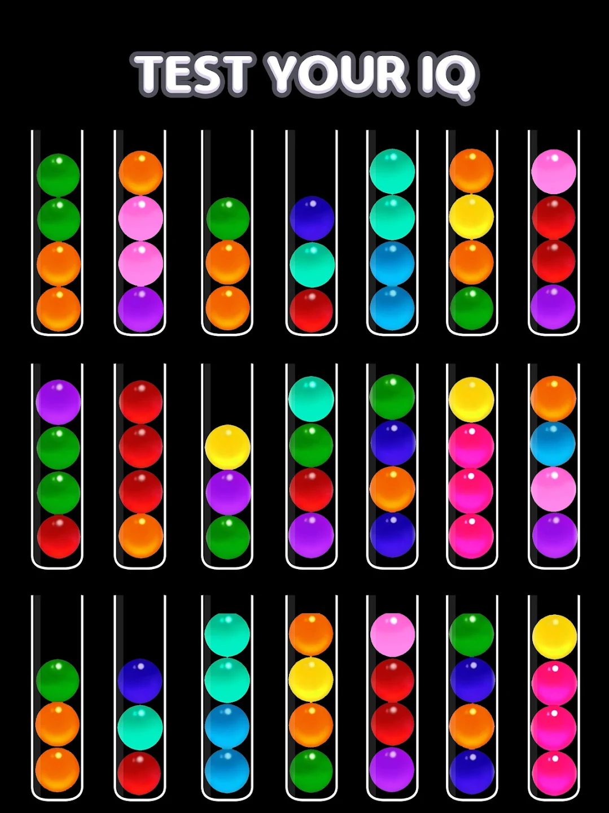
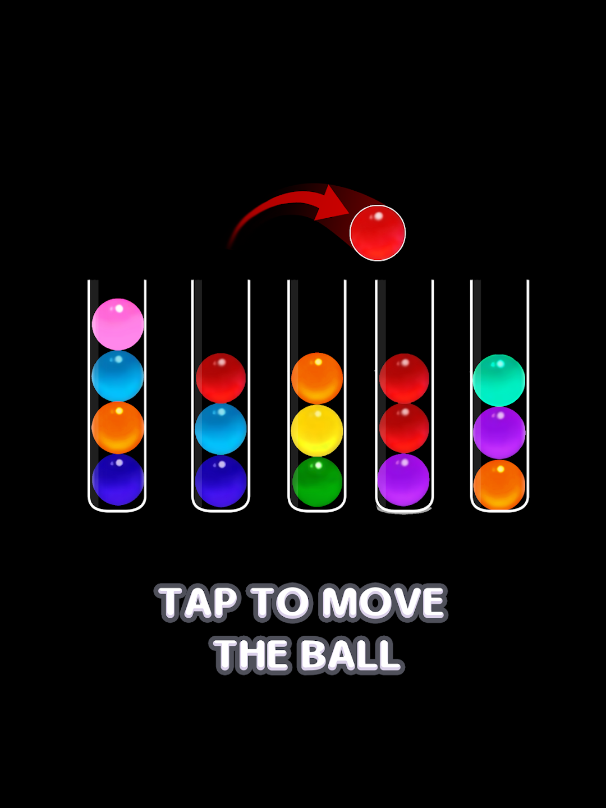

The Color Ball Puzzle Sorting Game is a visually engaging puzzle game developed using Unity and C#. Players sort colored balls into corresponding tubes, with increasingly challenging levels. The game features intuitive tap-and-drop controls, allowing users to seamlessly interact with the mechanics. Level generation is automated through a custom script, ensuring dynamic and unique gameplay. Animations for sorting, filling tubes, and fluid scene transitions enhance the visual appeal. Additionally, audio and visual effects elevate the player experience. Extensive testing ensures smooth performance across various devices.

Source: <a href="https://play.google.com/store/apps/details?id=com.playspare.colorballsort3d">Google Play Store</a>
