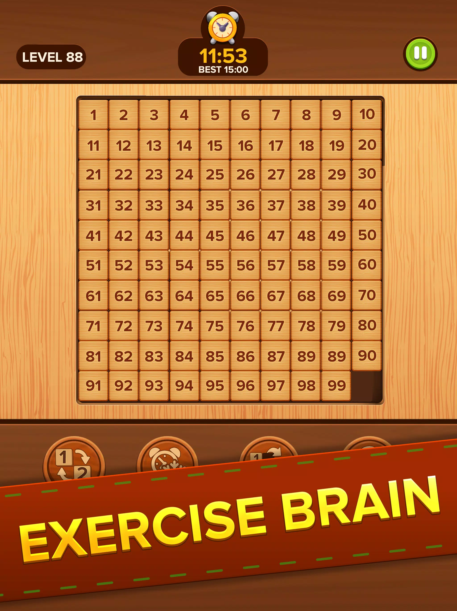

The Number Slide Puzzle Game provides a dual gameplay experience through its Classic and Picture modes. Classic mode challenges players to rearrange numbered tiles, while Picture mode displays an image that players must restore by sliding the tiles. The game includes various difficulty levels, user-friendly controls, and smooth transitions. Implemented using Unity, it features responsive touch or drag-and-drop mechanics. Puzzle levels are randomly generated to provide endless playability, with a timer for added challenge. The game is optimized for both mobile and tablet devices, ensuring a smooth, engaging user experience.
