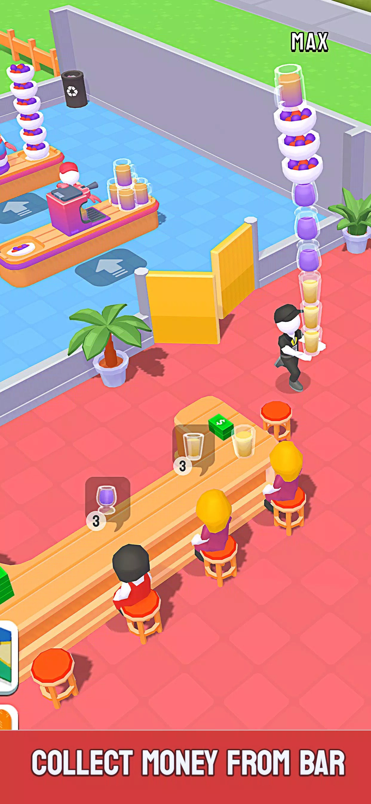

<h1>Game Development Process for Idle Restaurant Tycoon</h1>

<h2>Game Design</h2>
<h3>Core Gameplay Mechanics</h3>

Intuitive controls for managing orders, upgrading restaurants, and serving customers.

<h3>Progression System</h3>

Upgradeable elements like employees, food items, and customer areas to maintain player engagement and provide a rewarding progression loop.

<h3>Offline Play</h3>

Robust offline functionality allowing players to earn income while inactive.

<h2>Technical Implementation</h2>
<h3>Optimization</h3>

Optimized assets, scripts, and scene management to ensure smooth performance across devices.

<h3>Scalable Architecture</h3>

Modular systems for restaurant upgrades, employee AI, and customer behavior to support game scalability.

<h3>Dynamic Controls</h3>

Smooth and fluid controls for character movement, order management, and interactions.

<h2>Visuals and UI</h2>
<h3>Art Integration</h3>

Visually appealing animations and transitions implemented for an immersive gaming experience.

<h3>User Interface</h3>

Designed an intuitive UI for easy management of upgrades, earnings, and game interactions.

<h2>Additional Features</h2>
<h3>Global Competition</h3>

Leaderboards and competitions to engage players globally and add competitive elements.

<h3>Feedback Systems</h3>

Incorporated in-game feedback systems to help guide players through upgrades and tasks.

<h2>Challenges Addressed</h2>
<h3>Game Balancing</h3>

Ensured balanced progression to maintain fairness and avoid frustrating players.

<h3>AI Implementation</h3>

Developed AI for staff and customer behavior to create a lively restaurant atmosphere.

<h1>Conclusion</h1>

This development process involved a blend of creative design, technical expertise, and performance optimization to create an immersive and scalable idle tycoon game experience.

Source: <a href="https://apkpure.com/idle-restaurant-tycoon-games/com.playspare.hyperidlerestaurant">Google Play Store</a>
