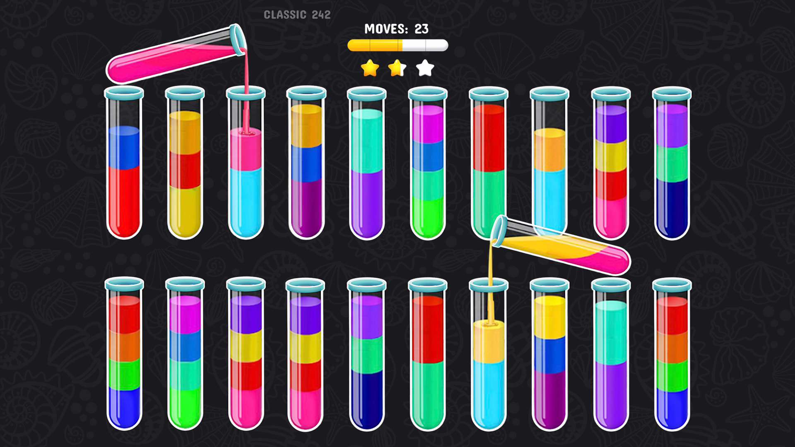

The game was built in Unity with C# scripting, using Unity’s 2D system for the water tube and sorting mechanics. Tap-and-drop controls were implemented for intuitive gameplay. The levels were generated using an auto-creation script, providing unique challenges. Animations for water flow and tube filling were created, and scene transitions were managed with Unity’s scene management system. Visual and audio effects enhanced the experience, and extensive testing was conducted to ensure smooth performance on various devices.


 
Source: <a href="https://play.google.com/store/apps/details?id=com.playspare.watersort3d&hl=en">Google Play Store</a> 
Source: <a href="https://apps.apple.com/us/app/color-water-sort-puzzle-3d/id1566301002">Apple App Store</a>
